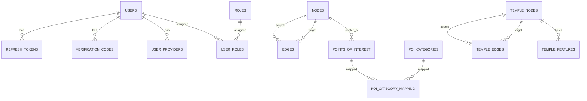

# Database Schema / ERD

Dokumen ini menjelaskan skema database PostgreSQL Borobudur Backend Service, termasuk relasi antar tabel dan model spasial Candi Borobudur.

> **Sumber data**: skema berikut dibaca langsung dari database PostgreSQL yang berjalan (bukan dari file migration di repo). Skema dasar tabel dibuat melalui framework migration terpisah yang filenya tidak tersedia di repository ini (lihat `docs/deployment.md`).

## Ringkasan

- **Database**: PostgreSQL
- **Ekstensi**: PostGIS (tipe `geometry`, SRID 4326), pgRouting (shortest path)
- **Jumlah tabel**: 20 tabel (termasuk tabel internal `migrations` dan `server_errors`)

### Diagram ERD

Diagram ERD lengkap tersedia sebagai file Mermaid di [`docs/diagrams/erd.mmd`](diagrams/erd.mmd):



---

## 1. Domain Authentication

### `users`

Menyimpan akun pengguna. Primary key bertipe `uuid`.

| Kolom             | Tipe        | Constraint            | Keterangan                        |
| ----------------- | ----------- | --------------------- | --------------------------------- |
| `id`              | uuid        | PK                    | Identitas pengguna                |
| `email`           | varchar(255)| NOT NULL, UNIQUE      | Email (index `users_email_key`)   |
| `name`            | varchar(255)| nullable              | Nama tampilan                     |
| `avatar_url`      | text        | nullable              | URL foto profil                   |
| `password_hash`   | text        | nullable              | Hash bcrypt (null untuk OAuth)    |
| `is_email_verified` | boolean   | nullable              | Status verifikasi email           |
| `last_login_at`   | timestamptz | nullable              | Waktu login terakhir              |
| `deleted_at`      | timestamptz | nullable              | Soft delete                       |
| `created_at`      | timestamptz | nullable              | —                                 |
| `updated_at`      | timestamptz | nullable              | —                                 |

### `roles`

| Kolom        | Tipe        | Constraint        | Keterangan                 |
| ------------ | ----------- | ----------------- | -------------------------- |
| `id`         | bigint      | PK                | —                          |
| `name`       | varchar(50) | NOT NULL, UNIQUE  | Nama role (`roles_name_key`) |
| `deleted_at` | timestamptz | nullable          | Soft delete                |

> **Catatan**: tabel `roles` ada, tetapi **tidak ada seed data** di repo (role dibuat manual saat dibutuhkan).

### `user_roles`

Tabel pivot many-to-many antara `users` dan `roles`.

| Kolom     | Tipe   | Constraint          | Keterangan    |
| --------- | ------ | ------------------- | ------------- |
| `user_id` | uuid   | PK, FK → `users`    | —             |
| `role_id` | bigint | PK, FK → `roles`    | —             |

### `refresh_tokens`

| Kolom        | Tipe        | Constraint         | Keterangan                      |
| ------------ | ----------- | ------------------ | ------------------------------- |
| `id`         | bigint      | PK                 | —                               |
| `user_id`    | uuid        | FK → `users`       | nullable                        |
| `token_hash` | text        | NOT NULL           | Hash refresh token              |
| `expires_at` | timestamptz | NOT NULL           | Waktu kedaluwarsa               |
| `revoked_at` | timestamptz | nullable           | Waktu revoke (logout)           |
| `created_at` | timestamptz | nullable           | —                               |

### `verification_codes`

| Kolom       | Tipe        | Constraint       | Keterangan                       |
| ----------- | ----------- | ---------------- | -------------------------------- |
| `id`        | bigint      | PK               | —                                |
| `user_id`   | uuid        | FK → `users`     | nullable                         |
| `code`      | varchar(255)| NOT NULL         | Kode verifikasi                  |
| `purpose`   | varchar(50) | NOT NULL         | Jenis (verify/reset)             |
| `expires_at`| timestamptz | NOT NULL         | Waktu kedaluwarsa                |
| `used_at`   | timestamptz | nullable         | Waktu kode dipakai               |
| `created_at`| timestamptz | nullable         | —                                |

### `user_providers`

Menyimpan kaitan akun OAuth (mis. Google).

| Kolom              | Tipe        | Constraint                   | Keterangan                          |
| ------------------ | ----------- | ---------------------------- | ----------------------------------- |
| `id`               | bigint      | PK                           | —                                   |
| `user_id`          | uuid        | FK → `users`                 | nullable                            |
| `provider`         | varchar(50) | NOT NULL                     | Nama provider (mis. `google`)       |
| `provider_user_id` | varchar(255)| NOT NULL, UNIQUE (bersama provider) | ID pengguna di provider       |
| `refresh_token`    | text        | nullable                     | Refresh token OAuth                 |
| `scope`            | text        | nullable                     | Scope OAuth                         |
| `created_at`       | timestamptz | nullable                     | —                                   |
| `updated_at`       | timestamptz | nullable                     | —                                   |

---

## 2. Domain Konten Heritage

### `news`

| Kolom                 | Tipe      | Constraint                 | Keterangan                       |
| --------------------- | --------- | -------------------------- | -------------------------------- |
| `id`                  | int       | PK                         | —                                |
| `title`               | varchar(255) | NOT NULL                | Judul                            |
| `content`             | text      | NOT NULL                   | Isi                              |
| `publication_date`    | date      | NOT NULL                   | Tanggal terbit                   |
| `image_url`           | text      | nullable                   | Gambar utama                     |
| `thumbnail_image_url` | text      | nullable                   | Thumbnail                        |
| `slug`                | varchar(255) | NOT NULL, UNIQUE       | Slug (`news_slug_key`)           |
| `author`              | varchar(100) | NOT NULL                | Penulis                          |
| `status`              | varchar(20) | NOT NULL, CHECK        | `draft`/`published`/`archived`   |
| `views_count`         | int       | nullable                   | Jumlah dibaca                    |
| `seo_metadata`        | jsonb     | nullable (GIN index)       | Metadata SEO                     |
| `created_at`          | timestamp | nullable                   | —                                |
| `updated_at`          | timestamp | nullable                   | —                                |

Index: `news_slug_key` (unique), `idx_news_*` (author, status, publication_date, seo_metadata).

### `articles`

Struktur identik dengan `news` (kolom sama), dengan index `articles_slug_key`, `idx_articles_*`.

### `events`

Mirip `news`/`articles`, dengan tambahan:

| Kolom       | Tipe         | Constraint                                   | Keterangan                             |
| ----------- | ------------ | -------------------------------------------- | -------------------------------------- |
| `name`      | varchar(255) | NOT NULL                                     | Nama event                             |
| `type`      | varchar(50)  | NOT NULL                                     | Tipe event                             |
| `start_date`| timestamp    | NOT NULL                                     | Waktu mulai                            |
| `end_date`  | timestamp    | nullable                                     | Waktu selesai                          |
| `location`  | varchar(255) | NOT NULL                                     | Lokasi                                 |
| `status`    | varchar(20)  | NOT NULL, CHECK                              | `upcoming`/`in_progress`/`completed`/`canceled` |

---

## 3. Domain Point of Interest

### `nodes`

Tabel titik spasial dasar (non-temple).

| Kolom   | Tipe     | Constraint            | Keterangan                       |
| ------- | -------- | --------------------- | -------------------------------- |
| `id`    | int      | PK                    | —                                |
| `name`  | text     | nullable              | Nama node                        |
| `type`  | text     | nullable              | Tipe (entrance, toilet, dll.)    |
| `geom`  | geometry | NOT NULL, POINT 4326  | Posisi (index `idx_nodes_geom`)  |

### `edges`

Tabel edge untuk graph dasar (pgRouting).

| Kolom          | Tipe     | Constraint                | Keterangan                          |
| -------------- | -------- | ------------------------- | ----------------------------------- |
| `id`           | int      | PK                        | —                                   |
| `source`       | int      | NOT NULL, FK → `nodes`    | Node asal                           |
| `target`       | int      | NOT NULL, FK → `nodes`    | Node tujuan                         |
| `cost`         | float    | NOT NULL                  | Bobot edge                          |
| `reverse_cost` | float    | nullable                  | Bobot arah balik                    |
| `geom`         | geometry | NOT NULL, LINESTRING 4326 | Geometri (index `idx_edges_geom`)   |

### `points_of_interest`

| Kolom          | Tipe      | Constraint            | Keterangan                            |
| -------------- | --------- | --------------------- | ------------------------------------- |
| `id`           | int       | PK                    | —                                     |
| `node_id`      | int       | NOT NULL, FK → `nodes`| Posisi POI (via node)                 |
| `description`  | text      | nullable              | Deskripsi                             |
| `opening_hours`| jsonb     | nullable              | Jam buka                              |
| `contact_info` | jsonb     | nullable              | Kontak                                |
| `image_url`    | text      | nullable              | Gambar                                |
| `rating`       | numeric   | nullable              | Rating                                |
| `metadata`     | jsonb     | nullable              | Metadata tambahan                     |
| `is_active`    | boolean   | nullable              | Status aktif                          |
| `created_at`   | timestamp | nullable              | —                                     |
| `updated_at`   | timestamp | nullable              | —                                     |

### `poi_categories`

| Kolom        | Tipe | Constraint            | Keterangan                       |
| ------------ | ---- | --------------------- | -------------------------------- |
| `id`         | int  | PK                    | —                                |
| `name`       | text | NOT NULL, UNIQUE      | Nama kategori (`poi_categories_name_key`) |
| `description`| text | nullable              | Deskripsi                        |

### `poi_category_mapping`

Pivot many-to-many antara `points_of_interest` dan `poi_categories`.

| Kolom         | Tipe | Constraint                          | Keterangan                          |
| ------------- | ---- | ----------------------------------- | ----------------------------------- |
| `poi_id`      | int  | PK, FK → `points_of_interest`       | —                                   |
| `category_id` | int  | PK, FK → `poi_categories`           | —                                   |

Index: `idx_poi_category_poi_id`, `idx_poi_category_category_id`.

---

## 4. Domain Temple / Spatial Model

Model spasial Borobudur terdiri dari empat tabel utama:

```
Temple
 |
 +-- Floor / Level  ── (temple_floor_contours)
 |
 +-- Temple Node    ── (temple_nodes: latitude, longitude, floor, altitude)
 |
 +-- Temple Edge    ── (temple_edges: from_node, to_node, is_stairs)
 |
 +-- Temple Feature ── (temple_features: POI dalam candi)
```

### `temple_nodes`

| Kolom        | Tipe     | Constraint                 | Keterangan                                    |
| ------------ | -------- | -------------------------- | --------------------------------------------- |
| `id`         | int      | PK                         | —                                             |
| `name`       | text     | nullable                   | Nama node                                     |
| `geom`       | geometry | NOT NULL, POINT 4326       | Posisi (index `idx_temple_nodes_geom`)        |
| `altitude_m` | float    | nullable                   | Ketinggian (meter)                            |
| `floor`      | int      | nullable                   | Lantai (index `idx_temple_nodes_floor`)       |
| `zone`       | varchar(50) | nullable               | Zona (index `idx_temple_nodes_zone`, `floor_zone`) |

### `temple_edges`

| Kolom          | Tipe     | Constraint                       | Keterangan                                   |
| -------------- | -------- | -------------------------------- | -------------------------------------------- |
| `id`           | int      | PK                               | —                                            |
| `source`       | int      | NOT NULL, FK → `temple_nodes`    | Node asal                                    |
| `target`       | int      | NOT NULL, FK → `temple_nodes`    | Node tujuan                                  |
| `cost`         | float    | NOT NULL                         | Bobot edge                                   |
| `reverse_cost` | float    | nullable                         | Bobot arah balik                             |
| `geom`         | geometry | NOT NULL, LINESTRING 4326        | Geometri (index `idx_temple_edges_geom`)     |
| `is_stairs`    | boolean  | NOT NULL, DEFAULT false          | Apakah edge berupa tangga (lintas lantai)    |

> **Catatan penting**: kode (`temples.controller.js` `getGraph`) merujuk kolom `type` pada `temple_edges` (untuk filter dan properti GeoJSON), tetapi **kolom `type` tidak ada di skema database**. Kolom `type` yang valid justru ada di `temple_features`. Lihat `docs/api-versioning.md`.

### `temple_features`

Fitur/POI di dalam kompleks candi.

| Kolom        | Tipe      | Constraint                    | Keterangan                                |
| ------------ | --------- | ----------------------------- | ----------------------------------------- |
| `id`         | int       | PK                            | —                                         |
| `node_id`    | int       | NOT NULL, FK → `temple_nodes` | Posisi feature (via node)                 |
| `type`       | text      | NOT NULL                      | Tipe feature                              |
| `name`       | text      | nullable                      | Nama                                      |
| `description`| text      | nullable                      | Deskripsi                                 |
| `image_url`  | text      | nullable                      | Gambar                                    |
| `rating`     | numeric   | nullable                      | Rating                                    |
| `metadata`   | jsonb     | nullable                      | Metadata                                  |
| `radius`     | int       | nullable                      | Radius deteksi (default 5 via migration)  |
| `created_at` | timestamp | nullable                      | —                                         |
| `updated_at` | timestamp | nullable                      | —                                         |

### `temple_floor_contours`

Poligon yang mendefinisikan batas setiap lantai.

| Kolom        | Tipe     | Constraint                       | Keterangan                                            |
| ------------ | -------- | -------------------------------- | ----------------------------------------------------- |
| `id`         | int      | PK                               | —                                                     |
| `floor`      | int      | NOT NULL, UNIQUE                 | Nomor lantai (`temple_floor_contours_floor_key`)      |
| `altitude_m` | float    | NOT NULL                         | Ketinggian lantai                                     |
| `name`       | varchar(100) | nullable                   | Nama lantai                                           |
| `geom`       | geometry | NOT NULL, POLYGON 4326           | Poligon lantai (index `idx_temple_floor_contours_geom`) |
| `created_at` | timestamp | nullable                        | —                                                     |
| `updated_at` | timestamp | nullable                        | —                                                     |

---

## 5. Tabel Internal

### `migrations`

Mencatat migration yang sudah dijalankan oleh framework migration eksternal.

| Kolom    | Tipe      | Constraint | Keterangan                          |
| -------- | --------- | ---------- | ----------------------------------- |
| `id`     | int       | PK         | —                                   |
| `name`   | varchar(255) | NOT NULL | Nama migration                      |
| `run_on` | timestamp | NOT NULL   | Waktu dijalankan                    |

### `server_errors`

Log error server (dipakai error handler).

| Kolom           | Tipe        | Constraint | Keterangan          |
| --------------- | ----------- | ---------- | ------------------- |
| `id`            | bigint      | PK         | —                   |
| `message`       | text        | NOT NULL   | Pesan error         |
| `stack`         | text        | nullable   | Stack trace         |
| `request_url`   | text        | nullable   | URL request         |
| `request_method`| varchar     | nullable   | HTTP method         |
| `request_body`  | jsonb       | nullable   | Body request        |
| `created_at`    | timestamptz | nullable   | —                   |

---

## 6. Visitor Data (Hyperbase / ScyllaDB)

Data koordinat/posisi pengunjung **tidak disimpan di PostgreSQL**, melainkan dikirim ke **Hyperbase** (Backend-as-a-Service berbasis **ScyllaDB**) pada collection **"coordinate data"**.

### Lokasi penyimpanan

| Properti            | Nilai                                  |
| ------------------- | -------------------------------------- |
| Project ID          | `01999716-74a3-7381-b727-6b3296a254cf` |
| Collection ID       | `01999717-f4d5-7ed3-b511-efc297b4ca94` |
| Nama collection     | `coordinate data`                      |
| `opt_auth_column_id`| `false`                                |
| `opt_ttl`           | `null` (tanpa TTL)                     |
| Tabel fisik ScyllaDB| `records_01999717f4d57ed3b511efc297b4ca94` |

### Schema fields

| Field        | Tipe   | required | indexed | unique | hashed | auth_column |
| ------------ | ------ | -------- | ------- | ------ | ------ | ----------- |
| `client_id`  | string | false    | false   | false  | false  | false       |
| `latitude`   | double | false    | false   | false  | false  | false       |
| `longitude`  | double | false    | false   | false  | false  | false       |
| `floor`      | int    | false    | false   | false  | false  | false       |
| `altitude_m` | double | false    | false   | false  | false  | false       |

### System fields (otomatis Hyperbase)

Field berikut tidak termasuk schema, tetapi otomatis dibuat/dikelola Hyperbase untuk setiap record:

- `_id` — UUIDv7 (identitas record)
- `_collection_id` — ID collection pemilik record
- `_created_by` — ID user/service pembuat record
- `_created_at`, `_updated_at` — timestamp

### Aliran data backend

1. Mobile mengirim `POST /v1/coordinate` dengan body `{ client_id, latitude, longitude, floor, altitude_m }`.
2. `src/controllers/v1/coordinate.controller.js` meneruskan payload sebagai record ke REST API Hyperbase (`POST /api/rest/project/{project_id}/collection/{collection_id}/records`).
3. Token autentikasi Hyperbase diperoleh/di-refresh oleh `src/worker/hyperbaseAuthWorker.js` (login password-based, refresh 24 jam).

### Catatan temuan

- Semua field `required: false` — Hyperbase menerima record walau ada field yang kosong.
- Tidak ada satupun field yang di-index — query berbasis `client_id`/`floor` akan memindai seluruh records (pertimbangkan `indexed: true` bila perlu analitik per-perangkat/lantai).
- `client_id` disimpan sebagai **plain string** (tidak di-hash) — tidak cocok menyimpan identifier yang bersifat sensitif.
- Tidak ada field timestamp/device metadata di schema; waktu record hanya dari system field `_created_at`/`_updated_at`.

> Dokumentasi lengkap aliran data pengunjung (autentikasi, retensi, privacy, checklist data) tersedia di [`docs/hyperbase.md`](hyperbase.md).

---

## Catatan / Gap

1. **Skema dasar tidak ada di repo** — file migration di repo (`migrations/*.sql`) hanya berisi perubahan inkremental (ALTER/seed); skema awal dibuat melalui framework migration terpisah (terlihat di tabel `migrations`).
2. **`temple_edges.type` tidak ada** di DB, meski dirujuk kode.
3. **CHECK constraint hanya ada 2** — `news.status` dan `events.status`. Validasi nilai `type` (mis. `walkway`/`road`/`stairs`/`ramp`) dilakukan di **backend validator** (`src/validator/*`), bukan di database.
4. **`roles` tidak memiliki seed data** di repo.
5. **`coordinates`** (disebut di beberapa dokumen awal) **bukan tabel PostgreSQL** — koordinat disimpan di Hyperbase/ScyllaDB (lihat bagian 6).
